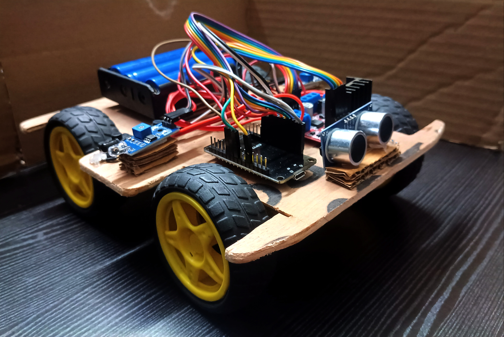

# 🤖 Maze-Solving Robot

[](https://isocpp.org/)
[](https://www.espressif.com/)
[](https://opensource.org/licenses/MIT)

A high-performance maze-solving robot designed for autonomous navigation. This project utilizes an ESP32 microcontroller to process sensor data, make real-time pathfinding decisions, and navigate complex maze structures efficiently.

---

## 🚀 Features

* **Autonomous Navigation:** Capable of solving unknown mazes without human intervention.
* **Intelligent Pathfinding:** Implements efficient navigation logic (e.g. Right-Hand Rule).
* **ESP32 Integration:** Leverages the power of the ESP32 for high-speed sensor polling and decision-making.
* **Sensor Fusion:** Seamless integration of distance/proximity sensors for real-time obstacle detection.

---

## 🛠️ Hardware Requirements

To replicate this build, you will need:

- **Microcontroller:** ESP32 Development Board
- **Sensors:** Ultrasonic or Infrared (IR) Distance Sensors
- **Motor Driver:** L298N or similar motor driver module
- **Motors:** DC Geared Motors
- **Power:** Li-ion batteries
- **Chassis:** Custom 3D printed or acrylic robot base [I have used wood]

---

### 🔌 Circuit Diagram
<div align="center">
  
</div>

---

## 💻 Software & Logic

The core logic resides in `Maze-robot.ino`. The robot operates on a decision-making loop:

1.  **Polling:** Continuously reads input from sensors to map the environment.
2.  **Logic:** Processes data to determine open paths.
3.  **Actuation:** Controls the motors to move forward, turn, or backtrack based on the algorithm (e.g., [Flood Fill](https://en.wikipedia.org/wiki/Flood_fill)).

### Prerequisites
* [Arduino IDE](https://www.arduino.cc/en/software)
* ESP32 Board Manager installed in Arduino IDE.

---

## ⚙️ Getting Started

1.  **Clone the repository:**
    ```bash
    git clone https://github.com/Verma-Sushaant/Maze-Solving-Robot.git
    ```
2.  **Upload the Code:**
    * Open `Maze-robot.ino` in your Arduino IDE.
    * Select your board (e.g., "DOIT ESP32 DEVKIT V1").
    * Connect your ESP32 and click **Upload**.

---

## 🏗️ Project Roadmap & Contributions

This project is part of my exploration into autonomous robotics and IoT systems. 

* *Current Status:* Functional prototype.
* *Planned Updates:*
    * Adding support for Bluetooth/Wi-Fi telemetry.
    * Refining the maze-mapping visualization on a web dashboard.
    * Using advanced algorithms like A* or Djkstra for maze-mapping.

---
 
### Prototype Robot
<div align="center">
  
</div>

---

---

## 📄 License
This project is licensed under the MIT License.

---
*Created by [Sushaant Verma](https://github.com/Verma-Sushaant)*
